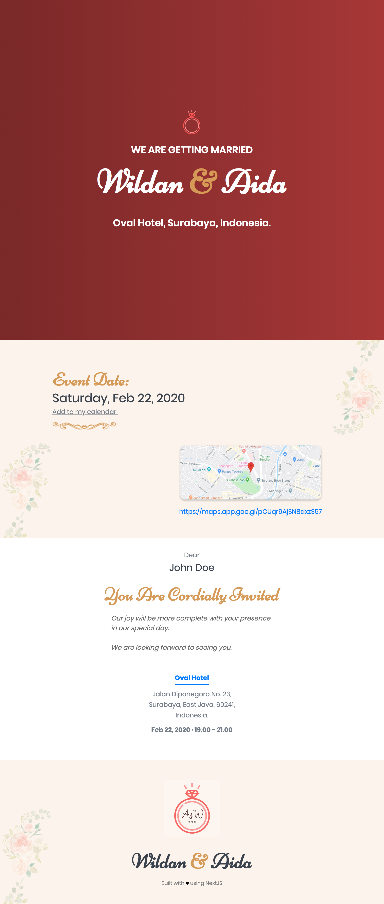

<h1 align="center">NextJS Wedding Invitation Template</h1>

### Features

- configurable parameters (e.g. map url, event date). see: `config/app.sample.js`
- autoplay animation in footer
- optional qr scanner
- optional unique links per guest (based on csv)
- i18n
- og tags

**Try in codesandbox:**

- Visit https://codesandbox.io/s/github/wzulfikar/nextjs-wedding-invite
- Rename `src/config/app.sample.js` to `src/config/app.js`
- Rename `pages/guest_list.sample.json` to `pages/guest_list.json`
- Change any value in `src/config/app.js` to see it updated in real time

**Live Demo:**
https://wedding-invite-demo.wzulfikar.now.sh

**Screenshot:**

